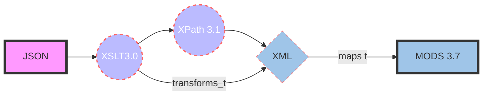

# JSON-to-MODS XSLT Transformation

**Summary:** This file contains information about transforming JSON to XML.  Once converted to XML, the metadata is mapped into the [MODS 3.7 schema](http://www.loc.gov/mods/v3).  

**Task:** Transform [Treesearch](https://www.fs.usda.gov/treesearch/) JSON files to MODS XML records for ingest into Unified Repository.

**metadata**: Treesearch metadata in JSON format from the [United States Forest Service (USFS)](https://www.fs.usda.gov/).

## Transformation process

The _[json_to_mods.xsl](https://github.com/CarlosMtz3/json-to-xml/blob/master/json-to-mods.xsl)_ utilizes the following formats and schema to transform the JSON format into MODS.

-   [JSON](https://www.json.org/json-en.html): (JavaScript Object Notation)
-   [XPath 3.1](https://www.w3.org/TR/xpath-31/): (XML Path Language)
-   [XSLT 3.0](https://www.w3.org/TR/xslt-30/): (Extensible Stylesheet Language Transformations)
-   [MODS 3.7](https://www.loc.gov/standards/mods/v3/mods-3-7.xsd) : (Metadata Object Description Schema)

###### *Each JSON file is first transformed to XML, upon which the XML produced is mapped its respective MODS element.

 ## Preparing JSON Files for XSLT Transformation

1. **Download and unzip the file** to a local directory. 
(e.g., "C:\users\\*{your-profile-name}*\\Desktop\". 
2. **Open *"json-to-mods"* file folder.**
3.  **Locate the *"working_directory"***. 
	 Open it.
4. **Locate three shell scripts** 
*- These will be run at different times throughout the **preparation** and **procedure**.*
 - *Shell Scripts List*
	-  (a) [merge_json.sh](https://github.com/CarlosMtz3/json-to-mods/blob/master/working-directory/merge-json.sh) - merges all *.json files within this directory. This is useful for creating  a merged view of the json data for analysis. **Run this file first**
	-  (b) [merge_xml.sh](https://github.com/CarlosMtz3/json-to-mods/blob/master/working-directory/merge-xml.sh) - merges all *.xml files contained within this directory. This is useful after transformation because it is easier to check if a specific element is available in every file.  **Run this file last**
	 - \(c\) [correct-invalid-chars.sh](https://github.com/CarlosMtz3/json-to-mods/blob/master/workingDir/correct-invalid-chars.sh) - this corrects several of the invalid characters found in the original treesearch metadata. It should  be run after **(a)** and before **(b)**. 
5.  **Run the merge_json.sh**
	-	 If data analysis is desired, the generated output from this file may be imported into OpenRefine. 
6.  **Run the data_amp_add.sh** 
	 - corrects all invalid character usage except for the misuse of the less than symbol (i.e. "<") in  the abstract of file [A-27260.json](https://github.com/CarlosMtz3/json-to-mods/blob/master/workingDir/A-29760.json). 
7. **The files are now prepared for transformation.**
	
	
## Preview test (optional)

  ***Use the debugger to a result***
1.  Open Oxygen. 
2. Select the debugger view. 
3.   Open a *"prepared JSON file"*.  
4.  Verify that there are **\<data\>** elements at the beginning of the file: 
	- *before the first opening curly brace* `<data> {` 
	-  *and at the end of the file* `}</data>`

	***Suggested file for preview testing:*** [A-3077.json](https://github.com/CarlosMtz3/json-to-mods/blob/master/workingDir/A-3077.json).
5.  Open the XSLT to test.  
			- json-to-mods_11-16-2021.xsl 
				 ***"...or..."*** 
			-  json-to-mods_11-22-2021.xsl
6.  Use the *"transformation tool set"* transform the file in to MODS XML.
	
7.  The setup and result should look like the image above. 
-----
## Transform Batch Test

**Batch Transform JSON Files to MODS XML**
1. Open the project view. Withing the working-directory, highlight all of the file starting with A and matching the pattern 
	 - "**A-#####.json**" 
	- (e.g., [A-4077.json](https://github.com/CarlosMtz3/json-to-mods/blob/master/workingDir/A-4077.json))
	- 
2. Right click and mouse over "Transformation Scenarios", select "Configure Transformation Scenarios" 

3. Select "New", then select "XML transformation with XSLT"

 4. Choose the json-to-mods.xsl as the transformation stylesheet. 

- Give the scenario a name. 
- Choose your transformer from the dropdown list. 
- Select OK. 
 ###### *No output should be set. 
5. The setup is completed, click "Apply Selected" to begin batch transformation. 

6. Review the results.  

## JSON to MODS Workflow
*A visualization of the transformation process written in Mermaid.* 

 **If the UML does not render, the image below is how the code above would render using Mermaid.*

### Discussion of element transformation 

- **MODS: Identifier and Location:**  The primary identifiers found in the Treesearch metadata are: *doi, product_id, and treesearch_pub_id.* 
	- from these **location** elements to the surrogate record and the resource itself are built to provide access. 

# Issues

## ISSUE #1: Page Numbering

  - [X] Task Complete?  **Yes. Resolved.**
 ***Page numbers are not consistently correct.***	
- When the following JSON string key values are present: 
	-	pub_start_page andpub_end_page,
	-	pub_page. 
 - No issues are present with page numbers.
 - When they are not, they must be derived from the “pub_publicaton” or citation” key values. 
		- Both of these files aree strings of text, with inconsistent formatting.
	-  While they mostly do contain some pagination information
	- It is difficult to get the correct data from a string of text
------
# ISSUE #2: random "station_id" acronym

  - [X] Task Complete?  **Yes. Resolved.**
**Description:** Extraneous “station_id” acronym appearing just outside the last author name tag. 
	 -  Have not been able to determine it’s origin. 
	 -  See screenshot below
	  

# Issue  3: invalid characters usage
**Issue**: Several TreeSearch files contain an invalid characters that will render invalid when the XML processor attempts to transform them
The filenames containing the issues are listed below. Some files contain more than one issue so they are listed twice. 

 - Chacters fixed
  	- & &rarr; `&amp;`
	 - ` ` &rarr; ` `
  - Characters still needing work 
 	- `< `&rarr;` &lt;` | Needs Resolution: The "working draft" (i.e. NOT the one used in this procedure) attempts to fix file A-29760.json by changing.. 
	`..(diameter at breast height `<`6 bin) with suppressed growth...`
 	- The less than symbol `<` should be written as `&lt;` in order to be transformed by the XSLT Processor. 
 	- The shell script does not do this without changing other valid html tags (e.g.      \&lt;i>\</i>) thus rendering the rest of the JSON document invalid. 

**Resolution:** The shell script provided to add `<data></data>` tags to the beginning and end of each document, adds a second statement and has resolved 3a. With more time, issues 3b, and 3c can also be resolved. 

 The following error message is rendered:
## Issue 3a:  "&"

**Filenames:** 
 - [x] A-26207.json
 - [x] A-26377.json
 - [x] A-29788.json
 - [x] A-29790.json
 - [x] A-29793.json

**Description:** *"The entity name must immediately follow the '&' in the entity reference."*
- [x] **Task Complete?** Yes
	
 

The shell script responsible for adding `<data></data>` to the beginning and end of each file, also contains a **sed** corrects this issue
*The statement below corrects the invalid ampersand*
  
      sed -i 's/\&[^amp;|^apos;|^quot;|^lt;|^gt;]/\&amp;/gi' "

## Issue 3b: "<" usage of less-than  
**Filename:** A-29760.json 
- [ ] **Task Complete?**  No. Possible to fix shell script. 
**Description:** The content of elements must consist of well-formed character data or markup.

	- The file contains the "<" symbol within the abstract. This is treated as an invalid character and thus renders and error.

> abstract: ...(diameter at breast height <6 in) with suppressed> growth...

Once the problem is corrected manually, it produces valid MODS metadata, and a valid JSON archival replica. 
This issue can be resolved if the shell script is improved to handle preprocess this bad character prior to transformation. 

## Issue 3c: "` `"
- ` ` &rarr; ` `
- 
<!--stackedit_data:
eyJoaXN0b3J5IjpbMzMzMzU5ODk0LC0xMDY0MTk2Nyw1NjYxND
YxMTZdfQ==
-->